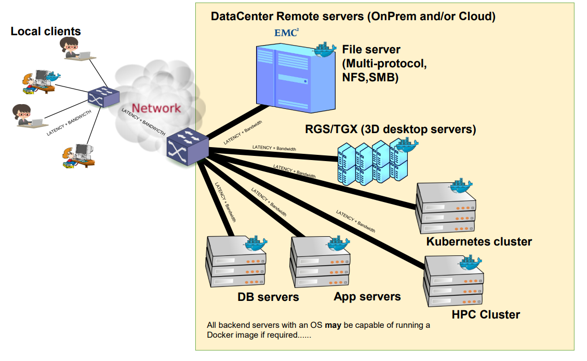
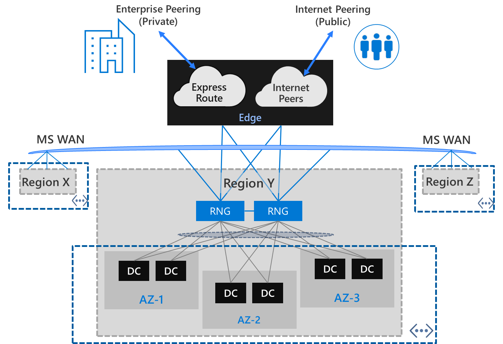
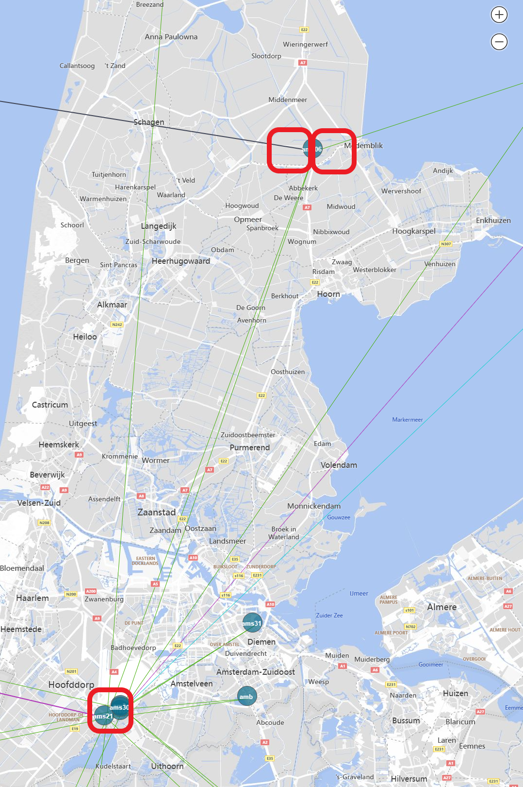
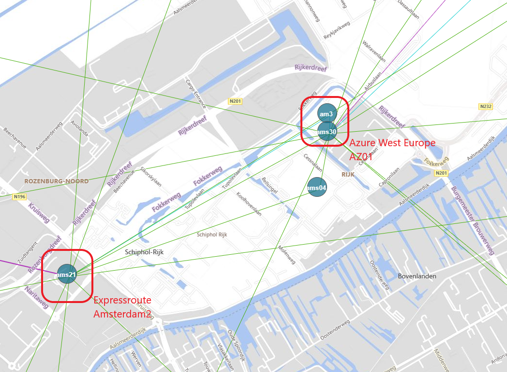
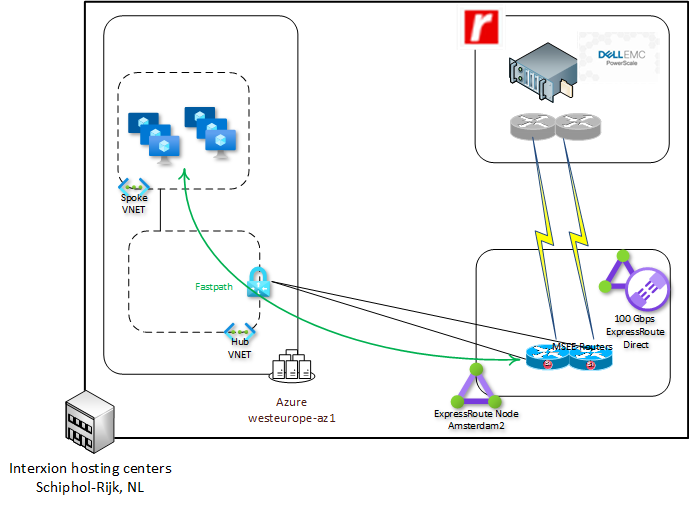
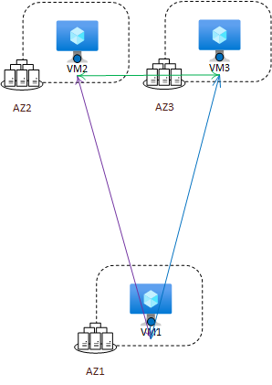
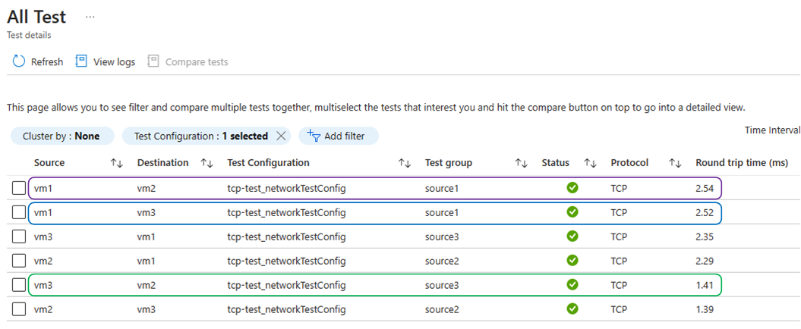

# Hybrid Connectivity at very high bandwidth and low latency

## The Problem

A customer in the oil and gas industry wanted to run geoscience applications on Azure HPC, while retaining data on a Dell Powerscale F900 storage platform hosted by Rackspace, under their Data Freedom offering. Bandwidth required between application and storage was 100Gbps and round trip delay had to be less than 1 ms. 



Distributing an application and its associated storage across hosting platforms is an anti-pattern, especially when high bandwidth and low latency are required. However, in this case Azure could not offer an adequate storage solution, while the customer did want to use Azure's HPC capabilities. The latency limitation required placing the Rackspace-managed storage platform almost directly adjacent to the HPC compute clusters.

## Background

Azure regions are generally hosted in Microsoft-owned datacenters, which are not accessible to third parties to host their services. The nearest a third party can usually get to Azure, are the non-Microsoft hosting centers where the WAN Edge and Expressroute peering nodes are hosted. These nodes are connected to their nearest Azure region via the Microsoft Wide Area Network. Although these are high performance connections, latency between an edge node and the nearest Azure region can still exceed 2 ms.

Azure regions usually consist of multiple datacenters located fairly closely together. These are grouped into Availability Zones: fault-isolated locations within an Azure region that provide redundant power, cooling, and networking. Azure regions that support Availability Zones have a minimum of three separate zones. Each availability zone consists of one or more data centers equipped with independent infrastructure power, network, and cooling. Availability zones are connected by a high-performance network with a round-trip latency of less than 2 milliseconds.



The Azure West Europe region in the Netherlands is a bit different from many other regions: it is distributed over Microsoft's own datacenter campus in Middenmeer, north of Amsterdam, and the Digital Realty / Interxion data centers in Schiphol-Rijk. Two of the region's Availability Zones are in Middenmeer, a third is in Schiphol-Rijk. Distance between these location is about 55 km, and latency between the AZ's in Middenmeer and the one in Schiphol-Rijk is just within the 2 ms envelope.



One of the Expressroute nodes in Amsterdam is also hosted with Interxion at Schiphol-Rijk, less than 1 km from the West Europe region Availability Zone.



## The Solution

Because one of the West Europe region's physical Availability Zones is close to the Amsterdam2 Expressroute peering node, which has high bandwidth Expressroute Direct service, and third party hosting space from Interxion is available in the same data center, a solution presented itself. The physical layout of Azure West Europe made it possible to host the HPC compute clusters in Azure physically very close to the storage platform, with low latency high bandwith connectivity between the two.

Building the solution involved of these steps:

- Pin the deployment of the HPC compute clusters to the physical AZ located at Schiphol-Rijk.
- Rackspace to host the Powerscale F900 storage platform in the Interxion AMS8 data center, where the Expressroute Amsterdam2 Expressroute peering node is located.
- Connect the storage platform to a 100Gbps Expressroute Direct port.
- Enable Fastpath, removing the ExpressRoute Gateway from the data path to make the full ER Direct bandwdith available between the compute nodes in Azure and the storage platform.



Pinning the deployment of the HPC compute clusters to a specific physical availability zone required some special attention. 

Each AZ-enabled Azure region consists of three or more physical [Availability Zones](https://learn.microsoft.com/en-us/azure/reliability/availability-zones-overview?tabs=azure-cli). These physical zones are mapped to logical zones in Azure subscriptions, at the time a subscription is created. The mapping is randomized, meaning that if in subscription A logical AZ 1 maps to physical AZ 01, in subscription B logical AZ 1 may map to physical AZ 03. This mechanism helps distribute workload evenly over physical AZ's. The physical-to-logical AZ mapping cannot be influenced or changed by the user, although after subscription creating the mapping can be viewed through an [API call](https://learn.microsoft.com/en-us/azure/reliability/availability-zones-overview?tabs=azure-cli#physical-and-logical-availability-zones).

For 2 subscriptions in West Europe, this may look like this:
```
[
{
    "availabilityZoneMappings": [
      {
        "logicalZone": "1",
        "physicalZone": "westeurope-az1"
      },
      {
        "logicalZone": "2",
        "physicalZone": "westeurope-az2"
      },
      {
        "logicalZone": "3",
        "physicalZone": "westeurope-az3"
      }
    ],
    "displayName": "West Europe",
    "id": "/subscriptions/7749fbb8-4096-4e85-8ad2-ef8182d01f02/locations/westeurope",
    "metadata": {
      "geography": "Europe",
      "geographyGroup": "Europe",
      "latitude": "52.3667",
      "longitude": "4.9",
      "pairedRegion": [
        {
          "id": "/subscriptions/7749fbb8-4096-4e85-8ad2-ef8182d01f02/locations/northeurope",
          "name": "northeurope"
        }
      ],
      "physicalLocation": "Netherlands",
      "regionCategory": "Recommended",
      "regionType": "Physical"
    },
    "name": "westeurope",
    "regionalDisplayName": "(Europe) West Europe",
    "type": "Region"
  }
]

[    
    {
    "availabilityZoneMappings": [
      {
        "logicalZone": "1",
        "physicalZone": "westeurope-az2"
      },
      {
        "logicalZone": "2",
        "physicalZone": "westeurope-az1"
      },
      {
        "logicalZone": "3",
        "physicalZone": "westeurope-az3"
      }
    ],
    "displayName": "West Europe",
    "id": "/subscriptions/b30dff1b-6791-4a70-a347-300819395986/locations/westeurope",
    "metadata": {
      "geography": "Europe",
      "geographyGroup": "Europe",
      "latitude": "52.3667",
      "longitude": "4.9",
      "pairedRegion": [
        {
          "id": "/subscriptions/b30dff1b-6791-4a70-a347-300819395986/locations/northeurope",
          "name": "northeurope"
        }
      ],
      "physicalLocation": "Netherlands",
      "regionCategory": "Recommended",
      "regionType": "Physical"
    },
    "name": "westeurope",
    "regionalDisplayName": "(Europe) West Europe",
    "type": "Region"
  }
]
```

The locations of the physicalZones are not disclosed, so with the above we still do not know whether westeurope-az1, 2, or 3 is located at Schiphol-Rijk.

Which-zone-is-which can be discovered by inspecting network latencies between Virtual Machines in each AZ. We know that 2 AZ are close together, on the same campus, and a third is some distance away. 



We should then see latency between one pair of VMs significantly lower than between the other 2 pairs:



These results suggest that VM1, in logical AZ1, is the one at the "remote" physical AZ in Schiphol-Rijk. With the logical-to-physical mapping  for the subscription this test was run in (see above), we can conclude that physicalZone "westeurope-az1" is the one hosted with Interxion at Schiphol-Rijk. 

When implementing the solution, the customer created a new subscription to host the compute clusters. They used the [List Locations Azure Resource Manager API](https://learn.microsoft.com/en-us/azure/reliability/availability-zones-overview?tabs=azure-cli#physical-and-logical-availability-zones) to determine which logical AZ in their new subscription corresponds to the physical AZ "westeurope-az1".
Rackspace hosted their storage solution in Interxion AMS8 and connected it to the a 100 Gbps ER Direct port in Amsterdam2.
Testing confirmed latency between application and storage was well within the 1ms envelope.

## Lab
