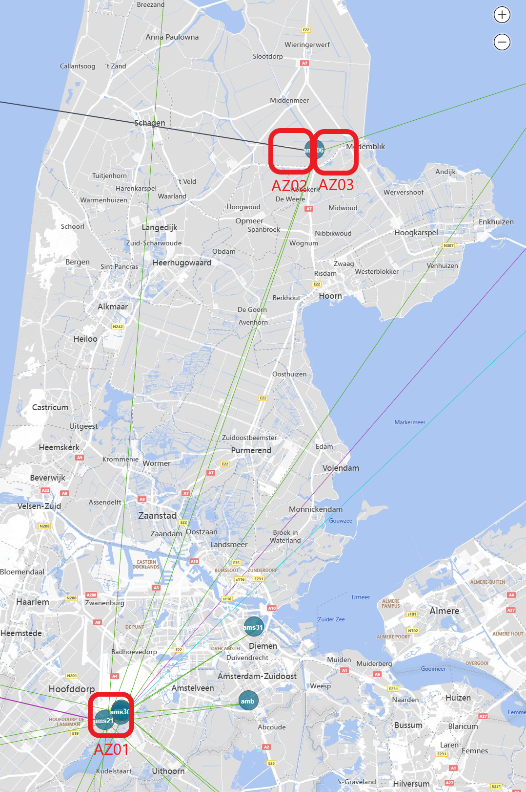

A customer in the oil and gas industry wanted to run geoscience applications on Azure HPC, while retaining data on a Dell Powerscale F900 storage platform hosted by Rackspace, under their Data Freedom offering. Bandwidth required between application and storage was 100Gbps and round trip delay had to be less than 1 ms. 

Distributing an application and its associated storage across hosting platforms is an anti-pattern, especially when high bandwidth and low latency are required. However, in this case Azure could not offer an adequate storage solution, while the customer did want to use Azure's HPC capabilities. The latency limitation required placing the Rackspace-managed storage platform almost directly adjacent to the HPC compute clusters.

Azure regions are generally hosted in Microsoft-owned datacenters, which are not accessible to third parties to host their services. The nearest a third party can usually get to Azure, are the non-Microsoft hosting centers where the WAN Edge and Expressroute peering nodes are hosted. These nodes are connected to their nearest Azure region via the Microsoft Wide Area Network. Although these are high performance connections, latency between an edge node and the nearest Azure region can still exceed 2 ms.

Azure regions usually consist of multiple datacenters located fairly closely together. These are grouped into Availability Zones: fault-isolated locations within an Azure region that provide redundant power, cooling, and networking. Azure regions that support Availability Zones have a minimum of three separate zones. Each availability zone consists of one or more data centers equipped with independent infrastructure power, network, and cooling. Availability zones are connected by a high-performance network with a round-trip latency of less than 2 milliseconds.

The Azure West Europe region in the Netherlands is a bit different from many other regions: it is distributed over Microsoft's own datacenter campus in Middenmeer, north of Amsterdam, and the Digital Realty / Interxion data centers in Schiphol-Rijk. Two of the region's Availability Zones are in Middenmeer, a third is in Schiphol-Rijk. Distance between these location is about 55 km, and latency between the AZ's in Middenmeer and the one in Schiphol-Rijk is just within the 2 ms envelope.

One of the Expressroute nodes in Amsterdam is also hosted with Interxion at Schiphol-Rijk, less than 1 km from the West Europe region Availability Zone.

Because one of the West Europe region's Availability Zones is close to the Amsterdam 2 Expressroute peering node, which has high bandwidth Expressroute Direct service, and third party hosting space from Interxion is available in the same data center, as solution presented itself:

